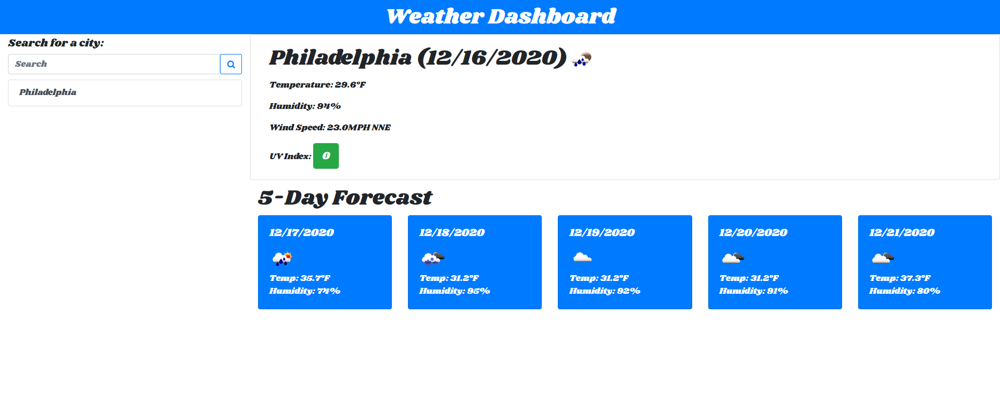
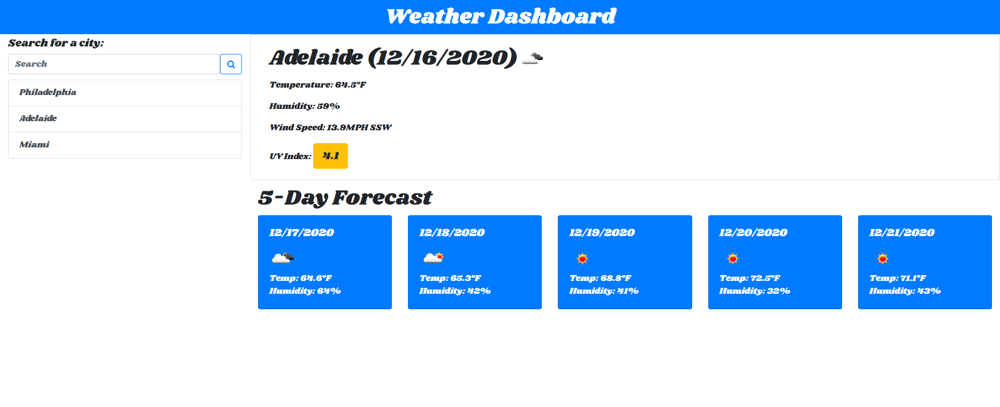

# weatherDashboard

#### By John Toth

## Description

This project demonstrates utilizing third party API calls to retrieve weather data for a user supplied city.  The weather data provided includes a weather-related icon and also a 5 day forecast for the selected city.  Openweathermap.org api was incorporated for the weather information displayed.  Date/time information was incorporated through the use of Day.js library.

Local storage was used to keep track of last searched upon city and have that city weather available upon browser refresh or launching the application.  While the application is open, any user search for a city is subsquently added to a search history list.  This permits the user to click a previously searched city to retrieve the weather about that city as opposed to having to search on it again.

The framework of the application was built in HTML for each of the sections: search history, search input & button, current weather information and 5 day forecast information.  The information for each of those sections was dynamically added via jQuery.  The weather dashboard application is also mobile responsive.

Additionally, the ultraviolet index (UVI) is color coded based upon how severe the retrieved number is for the UVI.  Another feature added to this application was making sure city name capitalization was consistent no matter how the user entered the city name.  The first letter of each word of city name is now capitalized.  

Code was added to prevent a user searched city from being added to the search history more than once.   If a user searches for a city already on the list, the weather is retrieved for that city but the search history is not updated.  Application is also displaying the wind degrees as a direction for current weather only (not the 5 day forecast): N, NNE, E, SSE, S, SSW, W, NNW.

## Screenshots

The following is a screenshot of the weather application upon first instance of opening it on a new device.  Due to no searched city yet, the weather information area is hidden from view until a search is performed.

  

The following is a screenshot of the weather application following a user searched city name.

  

The following is a screenshot of the weather application showing a different color code for the UVI.

  

## Setup/Installation Requirements

Direct link to repository:  https://github.com/jtoth7824/weatherDashboard

Direct link to Javascript Quiz webpage:  https://jtoth7824.github.io/weatherDashboard/

## Support and contact details

Please email me for further questions at jtoth7824@gmail.com

## Technologies Used

Third Party APIs

jQuery

Javascript

Local Storage
